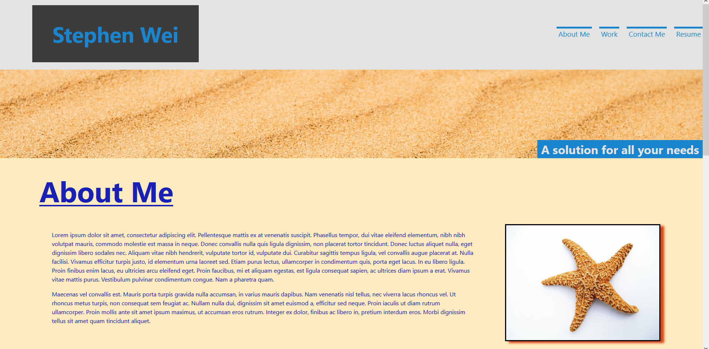

# Professional_Portfolio-challenge02

## Description

This project is part of a Challenge assignment. The purpose was to create a web application from scratch. Our goal is to buil d aportfolio page, to which we can add to as the course progresses.

A portfolio is meant to showcase skills and talents to employers looking to fill positions by highlighting our strongest work as well as the thought processes behind it. 

## Usage

This application is meant to present a potential employee's deployed portfolio of work samples so that an employer can review samples of their work and assess whether they are a good candidate.

## License

MIT License

Copyright (c) [2024] [Stephen Wei]

Permission is hereby granted, free of charge, to any person obtaining a copy
of this software and associated documentation files (the "Software"), to deal
in the Software without restriction, including without limitation the rights
to use, copy, modify, merge, publish, distribute, sublicense, and/or sell
copies of the Software, and to permit persons to whom the Software is
furnished to do so, subject to the following conditions:

The above copyright notice and this permission notice shall be included in all
copies or substantial portions of the Software.

THE SOFTWARE IS PROVIDED "AS IS", WITHOUT WARRANTY OF ANY KIND, EXPRESS OR
IMPLIED, INCLUDING BUT NOT LIMITED TO THE WARRANTIES OF MERCHANTABILITY,
FITNESS FOR A PARTICULAR PURPOSE AND NONINFRINGEMENT. IN NO EVENT SHALL THE
AUTHORS OR COPYRIGHT HOLDERS BE LIABLE FOR ANY CLAIM, DAMAGES OR OTHER
LIABILITY, WHETHER IN AN ACTION OF CONTRACT, TORT OR OTHERWISE, ARISING FROM,
OUT OF OR IN CONNECTION WITH THE SOFTWARE OR THE USE OR OTHER DEALINGS IN THE
SOFTWARE.